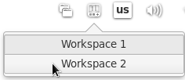

# Wingpanel Workspaces Indicator

Manage your dynamic workspaces from the panel.

## Building and Installation

You'll need the following dependencies to build:
* valac
* libgtk-3-dev
* libgranite-dev
* libwnck-3-dev
* libwingpanel-2.0-dev
* meson

## How To Build

    meson build --prefix /usr --buildtype=plain
    ninja -C build
    sudo ninja -C build install
